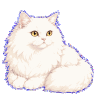
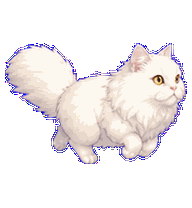
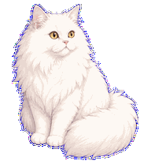
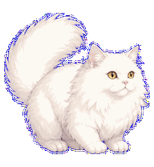
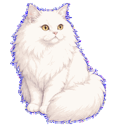

# my-cat — Codex Pet

[中文](#中文) · [English](#english)



| 小跑 / Running | 挥爪 / Waving | 跳跃 / Jumping | 失败 / Failed |
|---|---|---|---|
|  |  |  |  |

## 中文

`my-cat` 是一只陪伴主人写代码的白色长毛猫 Codex Pet。它有金黄色眼睛、粉色鼻子和蓬松大尾巴，采用柔和粉白色的 Q 版手绘风格。

### 动画

- 待机与趴着休息
- 向左/向右小跑
- 挥爪、跳跃、等待、思考
- 任务进行、失败反馈和方向注视

### 安装

1. 下载或克隆本仓库。
2. 将 `my-cat` 文件夹完整复制到：

   ```text
   ~/.codex/pets/my-cat/
   ```

3. 确认目录中包含：

   ```text
   pet.json
   spritesheet.webp
   ```

4. 重新启动 Codex，在 Codex 设置的 Pet/宠物选项中选择 `my-cat`。

### 许可

本项目采用 [CC BY-NC 4.0](LICENSE) 许可。允许在署名的前提下分享和修改，但禁止商业使用。猫咪原始照片不包含在仓库中，也不属于本仓库许可范围。

## English

`my-cat` is a fluffy white Codex companion that keeps you company while you code. It features golden eyes, a pink nose, a large fluffy tail, and a soft pink-and-white hand-drawn chibi style.

### Animations

- Idle and lying-down rest
- Running left and right
- Waving, jumping, waiting, and reviewing
- Active-task, failure feedback, and directional looks

### Installation

1. Download or clone this repository.
2. Copy the complete `my-cat` folder to:

   ```text
   ~/.codex/pets/my-cat/
   ```

3. Make sure the folder contains `pet.json` and `spritesheet.webp`.
4. Restart Codex, then select `my-cat` in the Pet section of Codex settings.

### License

This project is licensed under [CC BY-NC 4.0](LICENSE). Sharing and adaptations are allowed with attribution, but commercial use is prohibited. The original cat photographs are not included and are not covered by this repository's license.
